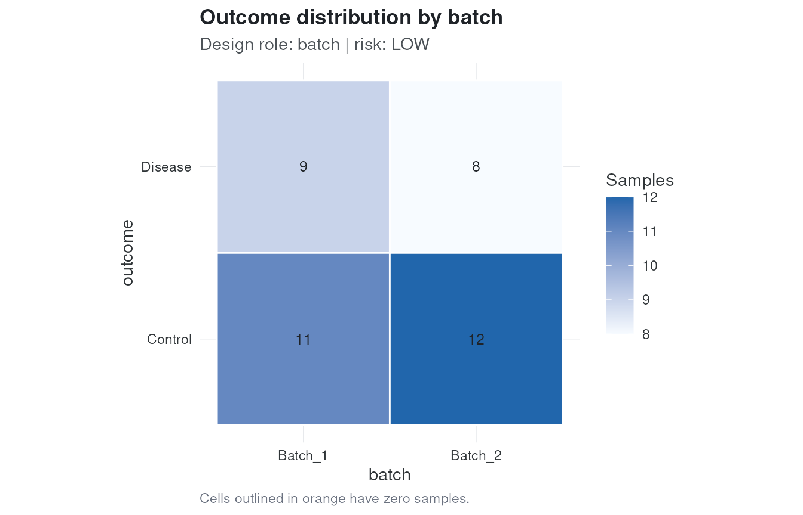
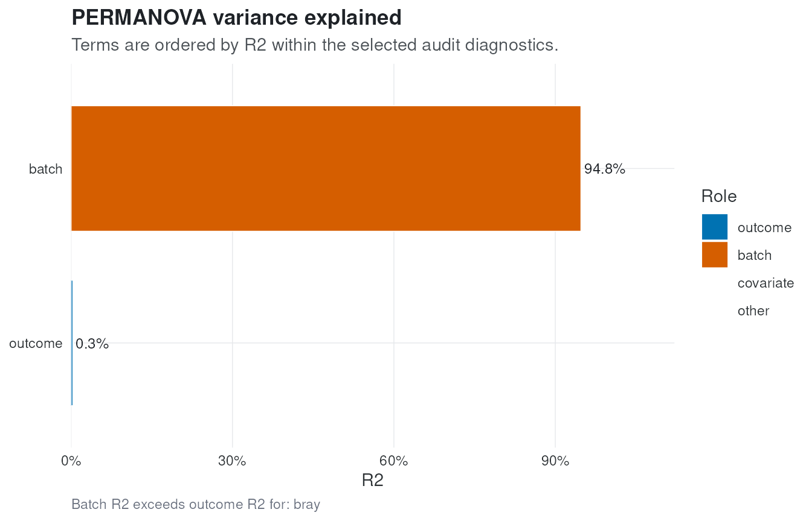

# Auditing microbiome study designs with MOAT

## Why Audit Microbiome Studies?

Microbiome analyses are sensitive to study design. Outcome groups can be
confounded with center, sequencing run, extraction kit, visit, or
subject identity. When this happens, downstream analyses can report
biological differences that are partly or entirely driven by technical
or design structure.

MOAT audits those risks before analysis. It does not automatically
correct counts or decide the final model. Instead, it returns
diagnostics, warnings, plots, and analysis-plan recommendations that
help make the study design explicit. Before crossing into microbiome
analysis, check the moat.

## Load the Toy Dataset

``` r

library(moat)
data("toy_moat")

toy_moat
#> class: SummarizedExperiment 
#> dim: 50 40 
#> metadata(0):
#> assays(1): counts
#> rownames(50): Taxon_001 Taxon_002 ... Taxon_049 Taxon_050
#> rowData names(0):
#> colnames(40): S01 S02 ... S39 S40
#> colData names(3): sample_id outcome batch
```

The example dataset is a small simulated `SummarizedExperiment` with
count data and sample metadata.

``` r

head(SummarizedExperiment::colData(toy_moat))
#> DataFrame with 6 rows and 3 columns
#>       sample_id     outcome       batch
#>     <character> <character> <character>
#> S01         S01     Control     Batch_1
#> S02         S02     Control     Batch_1
#> S03         S03     Control     Batch_1
#> S04         S04     Disease     Batch_1
#> S05         S05     Control     Batch_1
#> S06         S06     Disease     Batch_1
```

## Run the Audit

For examples and vignettes we use a small number of permutations. Real
analyses should generally use a larger value, such as the default `999`.

``` r

audit <- moat(
  toy_moat,
  outcome = "outcome",
  batch = "batch",
  distances = "bray",
  n_perm = 99,
  verbose = FALSE
)

summary(audit)
#> 
#> ── MOAT audit ──────────────────────────────────────────────────────────────────
#> ℹ Overall risk: HIGH
#> 
#> ── Main warnings ──
#> 
#> • Batch audit for bray distance has high risk (batch R2 = 0.948; PERMANOVA =
#> high, dispersion = low, PCoA = high).
#> • Feature-level batch diagnostic is high (50 feature-batch associations with
#> adjusted p <= 0.05 and batch R2 >= 0.1; max feature batch R2 = 0.973).
#> 
#> ── Recommended next steps ──
#> 
#> • Batch signal is strong in distance, ordination, dispersion, or feature-level
#> diagnostics; report batch diagnostics before downstream analysis.
#> • Avoid interpreting outcome effects without sensitivity analyses that account
#> for batch.
#> • Batch adjustment appears statistically identifiable based on metadata
#> diagnostics.
#> • Overall leakage risk is low.
#> • No subject variable provided; repeated-measure leakage was not evaluated.
#> • Batch variables appear balanced enough for standard validation.
#> • No time variable provided; temporal leakage was not evaluated.
```

For compact reporting,
[`module_risks()`](https://xec-cm.github.io/moat/reference/module_risks.md)
extracts the module-level status and main reason without requiring users
to inspect the nested audit object.

``` r

module_risks(audit)
#> # A tibble: 4 × 6
#>   module     status    risk  main_reason             n_reasons n_recommendations
#>   <chr>      <chr>     <chr> <chr>                       <int>             <int>
#> 1 design     evaluated low   Design audit risk is l…         1                 0
#> 2 batch      evaluated high  Batch audit for bray d…         2                 2
#> 3 correction evaluated low   Batch adjustment appea…         1                 1
#> 4 leakage    evaluated low   Overall leakage risk i…         4                 4
```

## Interpret Design Risk

The design module checks whether metadata variables are associated with
the outcome. For categorical variables it stores a contingency table,
Cramer’s V, empty-cell counts, and a conservative risk label.

``` r

audit$design[, c(
  "variable",
  "role",
  "variable_type",
  "effect_size_name",
  "effect_size",
  "empty_cells",
  "risk"
)]
#>   variable  role variable_type effect_size_name effect_size empty_cells risk
#> 1    batch batch   categorical        cramers_v  0.05057217           0  low
```

[`plot_design()`](https://xec-cm.github.io/moat/reference/plot_design.md)
shows the outcome distribution across an audited categorical variable.
Empty cells are outlined because they can indicate confounding or
complete separation.

``` r

plot_design(audit, variable = "batch")
```



## Interpret Correction Feasibility

Batch adjustment is only meaningful when outcome and batch are not
perfectly aliased. The correction module summarizes whether ordinary
adjustment appears identifiable from the metadata.

``` r

audit$correction$feasibility
#> [1] "safe"
audit$correction$recommendations
#> [1] "Batch adjustment appears statistically identifiable based on metadata diagnostics."
```

This diagnostic is not a command to correct the data. It is a warning
about what kinds of downstream adjustment are statistically defensible.

Thresholds used by all risk modules are documented in the companion
article
[`vignette("risk-thresholds", package = "moat")`](https://xec-cm.github.io/moat/articles/risk-thresholds.md)
and exposed as a table by
[`risk_thresholds()`](https://xec-cm.github.io/moat/reference/risk_thresholds.md).

## Interpret Batch Risk

The batch module combines distance-based PERMANOVA, dispersion
diagnostics, and ordination-axis association checks. The summary table
reports how much microbiome variation is attributed to the outcome and
to batch.

``` r

audit$batch$summary[, c(
  "distance",
  "outcome_r2",
  "batch_r2",
  "batch_dominance_score",
  "permanova_risk",
  "permdisp_risk",
  "pcoa_risk",
  "risk"
)]
#>   distance  outcome_r2  batch_r2 batch_dominance_score permanova_risk
#> 1     bray 0.003494571 0.9477919              271.2184           high
#>   permdisp_risk pcoa_risk risk
#> 1           low      high high
```

Feature-level screening is available in `audit$batch$features`. It flags
taxa with strong batch association as pre-analysis evidence to report
and inspect, not as a replacement for downstream differential abundance
models.

[`plot_variance()`](https://xec-cm.github.io/moat/reference/plot_variance.md)
visualizes the PERMANOVA R2 terms. A batch term that exceeds the outcome
term is a strong signal that the downstream analysis needs explicit
batch sensitivity checks.

``` r

plot_variance(audit, distance = "bray")
```



## Interpret Leakage Risk

Validation leakage can occur when samples from the same subject, batch,
or time structure are split across train and test folds in a way that
makes prediction look better than it is. MOAT reports the recommended
cross-validation scheme based on the metadata supplied to
[`moat()`](https://xec-cm.github.io/moat/reference/moat.md).

``` r

audit$leakage$recommended_cv
#> [1] "standard_cv"
audit$leakage$recommendations
#> [1] "Overall leakage risk is low."                                             
#> [2] "No subject variable provided; repeated-measure leakage was not evaluated."
#> [3] "Batch variables appear balanced enough for standard validation."          
#> [4] "No time variable provided; temporal leakage was not evaluated."
```

## Generate an Analysis Plan

[`plan_analysis()`](https://xec-cm.github.io/moat/reference/plan_analysis.md)
translates the audit into recommended formulas, validation schemes,
batch strategy, and sensitivity analyses.

``` r

plan_analysis(audit)
#> 
#> ── MOAT analysis plan ──────────────────────────────────────────────────────────
#> ℹ Overall risk: HIGH
#> 
#> ── Recommended formulas ──
#> 
#> • Differential abundance: `~ outcome + batch`
#> • PERMANOVA: `distance ~ outcome + batch`
#> 
#> ── Validation ──
#> 
#> • standard_cv: Standard cross-validation is acceptable for the supplied leakage
#> variables.
#> 
#> ── Batch strategy ──
#> 
#> • sensitivity_required: Batch explains substantial microbiome variation; report
#> analyses with explicit batch sensitivity checks.
#> 
#> ── Sensitivity analyses ──
#> 
#> • Repeat microbiome association analyses with and without batch terms where
#> identifiable.
#> • Report distance-specific PERMANOVA results and batch R2 alongside outcome R2.
#> 
#> ── Warnings ──
#> 
#> ! Batch audit for bray distance has high risk (batch R2 = 0.948; PERMANOVA = high, dispersion = low, PCoA = high).
#> ! Feature-level batch diagnostic is high (50 feature-batch associations with adjusted p <= 0.05 and batch R2 >= 0.1; max feature batch R2 = 0.973).
#> ! Batch-dominated microbiome signal requires explicit sensitivity analysis.
```

The plan should be read as a structured starting point. Analysts still
need to choose methods appropriate for their scientific question, data
distribution, and experimental design.

## Session Information

``` r

sessionInfo()
#> R version 4.5.2 (2025-10-31)
#> Platform: x86_64-pc-linux-gnu
#> Running under: Ubuntu 24.04.3 LTS
#> 
#> Matrix products: default
#> BLAS:   /usr/lib/x86_64-linux-gnu/openblas-pthread/libblas.so.3 
#> LAPACK: /usr/lib/x86_64-linux-gnu/openblas-pthread/libopenblasp-r0.3.26.so;  LAPACK version 3.12.0
#> 
#> locale:
#>  [1] LC_CTYPE=en_US.UTF-8       LC_NUMERIC=C              
#>  [3] LC_TIME=en_US.UTF-8        LC_COLLATE=en_US.UTF-8    
#>  [5] LC_MONETARY=en_US.UTF-8    LC_MESSAGES=en_US.UTF-8   
#>  [7] LC_PAPER=en_US.UTF-8       LC_NAME=C                 
#>  [9] LC_ADDRESS=C               LC_TELEPHONE=C            
#> [11] LC_MEASUREMENT=en_US.UTF-8 LC_IDENTIFICATION=C       
#> 
#> time zone: UTC
#> tzcode source: system (glibc)
#> 
#> attached base packages:
#> [1] stats     graphics  grDevices utils     datasets  methods   base     
#> 
#> other attached packages:
#> [1] moat_0.99.0      BiocStyle_2.38.0
#> 
#> loaded via a namespace (and not attached):
#>  [1] SummarizedExperiment_1.40.0 gtable_0.3.6               
#>  [3] xfun_0.57                   bslib_0.10.0               
#>  [5] ggplot2_4.0.3               htmlwidgets_1.6.4          
#>  [7] Biobase_2.70.0              lattice_0.22-9             
#>  [9] vctrs_0.7.3                 tools_4.5.2                
#> [11] generics_0.1.4              stats4_4.5.2               
#> [13] parallel_4.5.2              tibble_3.3.1               
#> [15] cluster_2.1.8.2             pkgconfig_2.0.3            
#> [17] Matrix_1.7-5                RColorBrewer_1.1-3         
#> [19] S7_0.2.2                    desc_1.4.3                 
#> [21] S4Vectors_0.48.1            lifecycle_1.0.5            
#> [23] compiler_4.5.2              farver_2.1.2               
#> [25] textshaping_1.0.5           Seqinfo_1.0.0              
#> [27] permute_0.9-10              htmltools_0.5.9            
#> [29] sass_0.4.10                 yaml_2.3.12                
#> [31] pillar_1.11.1               pkgdown_2.2.0.9000         
#> [33] jquerylib_0.1.4             MASS_7.3-65                
#> [35] cachem_1.1.0                DelayedArray_0.36.1        
#> [37] vegan_2.7-3                 abind_1.4-8                
#> [39] nlme_3.1-169                tidyselect_1.2.1           
#> [41] digest_0.6.39               dplyr_1.2.1                
#> [43] bookdown_0.46               labeling_0.4.3             
#> [45] splines_4.5.2               fastmap_1.2.0              
#> [47] grid_4.5.2                  cli_3.6.6                  
#> [49] SparseArray_1.10.10         magrittr_2.0.5             
#> [51] S4Arrays_1.10.1             utf8_1.2.6                 
#> [53] withr_3.0.2                 scales_1.4.0               
#> [55] rmarkdown_2.31              XVector_0.50.0             
#> [57] matrixStats_1.5.0           otel_0.2.0                 
#> [59] ragg_1.5.2                  evaluate_1.0.5             
#> [61] knitr_1.51                  GenomicRanges_1.62.1       
#> [63] IRanges_2.44.0              mgcv_1.9-4                 
#> [65] rlang_1.2.0                 glue_1.8.1                 
#> [67] BiocManager_1.30.27         BiocGenerics_0.56.0        
#> [69] jsonlite_2.0.0              R6_2.6.1                   
#> [71] MatrixGenerics_1.22.0       systemfonts_1.3.2          
#> [73] fs_2.1.0
```
